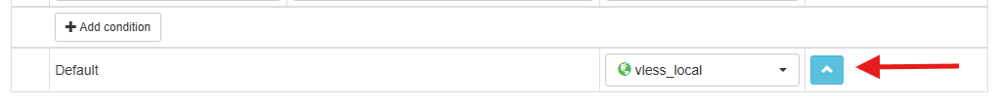
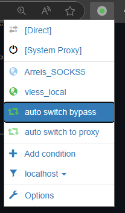

Если вы используете расширение SwitchyOmega в браузере, его можно настроить для работы через v2rayN.

### Настройка прокси

1. Откройте настройки SwitchyOmega, перейдите в настройки сервера прокси
2. Выберите тип `HTTP`
3. В поле Server впишите `127.0.0.1`
4. В поле Port укажите `10809` (значение указано слева снизу на главном экране v2rayN)

### Настройка правил

1. Перейдите в набор правил, который использовали раньше
2. Внизу набора правил выберите нужный сервер и нажмите на стрелку — она применит ко всем правилам выбранный сервер
3. Верните обратно `Direct` в этом списке
4. Нажмите `Apply changes`

    

### Режимы использования

- **Набор правил SwitchyOmega** — полностью игнорирует правила v2rayN для остальной системы и использует только правила расширения
- **System Proxy** — использует правила, настроенные в v2rayN
- **Direct** — чистый интернет без каких-либо правил и проксирования

