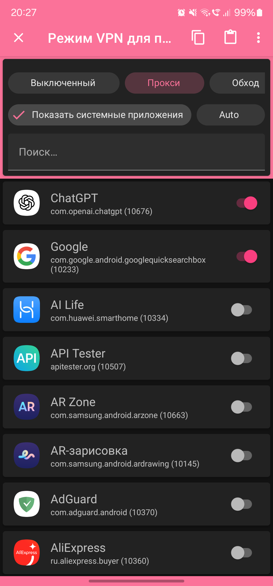
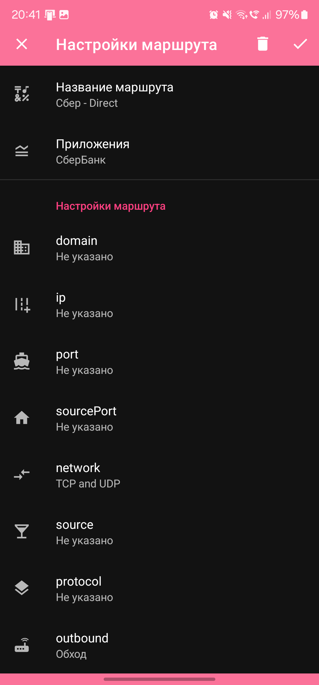

После базовой настройки NekoBox можно более тонко настроить маршрутизацию на Android.

### Маршруты

Во вкладке `Маршруты` установлены такие же правила, как в версии для ПК: блокировка рекламы и пропуск торрентов без VPN. Если включить правило `Global - CIS`, запросы на сайты в РФ, Беларуси и Казахстане будут идти напрямую, без VPN.

По умолчанию VPN проксирует весь трафик на телефоне.

### Маршрутизация для отдельных приложений

Приложение позволяет направлять трафик через VPN только для отдельных приложений двумя способами.

#### Способ 1: Режим VPN для приложений

1. Перейдите в `Настройки` → `Режим VPN для приложений`
2. Выберите режим `Прокси` и отметьте нужные приложения
3. Если нужно направлять трафик для всех приложений, кроме отдельных (например, банковских), выберите режим `Обход` и отметьте исключения
4. Для отключения этого режима выберите `Выключенный`

    

#### Способ 2: Через маршруты

1. Перейдите во вкладку `Маршруты` и создайте новый маршрут
2. В поле `Название маршрута` впишите любое имя
3. В поле `Приложения` выберите нужные приложения
4. В поле `outbound` выберите `Обход`, если нужно, чтобы эти приложения выходили в интернет напрямую
5. Расположите правило над другими правилами, которые могут на него влиять (например, над `Global - CIS`)

**Совет:** после применения настроек маршрутизации переподключитесь к VPN. Для удобства можно найти в настройках шторки телефона кнопку для быстрого подключения.

