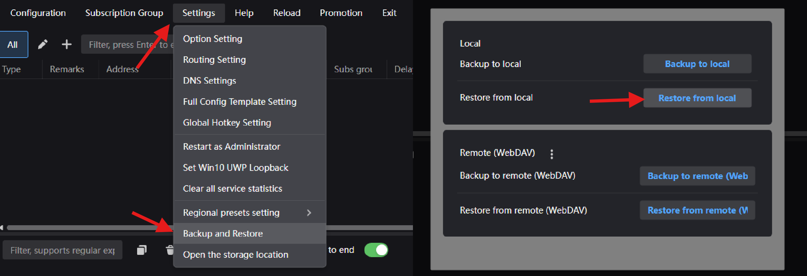

### Откройте установленный клиент и импортируйте конфигурацию

1. Скачайте файл с предустановками:
   - для РФ — <a href="/presets/v2rayn_preset_ru" download>Скачать с сервера</a>
   - для других стран — <a href="/presets/v2rayn_preset_cis" download>Скачать с сервера</a>
2. В клиенте откройте `Settings` → `Restore and Backup` → `Restore from local` и выберите скачанный файл. Программа перезапустится

    

3. Проверьте и установите обновления: 
    1. На главном экране выберите `Help` -> `Check Update`. 
    2. Активируйте все переключатели, нажимите `Check Update`
    3. Дождитесь скачивания всех файлов.

4. Скопируйте свою ссылку-подписку и нажмите `Ctrl + V` в окне клиента

**Совет:** если `Ctrl + V` не сработало, добавьте подписку вручную: `Subscription Group` → `Subscription group settings` → `Add`. В поле `Remarks` введите название, в поле `URL` — ссылку-подписку.

5. Обновите подписку: `Subscription Group` → `Update subscriptions without proxy`

**Важно:** если у вас перестал работать VPN, попробуйте обновить подписку. Если это не помогло, то скорее всего изменился адрес сервера. В этом случае запросите новую ссылку-подписку в боте!

