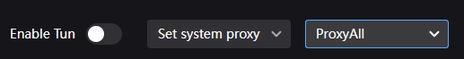

### Выберите сервер и активируйте VPN

1. Внизу главного экрана выберите правило маршрутизации — рекомендуется `ProxyAll`
2. Рядом нажмите `Set system proxy`

    

3. VPN подключён!

### Проверка подключения

После подключения убедитесь, что VPN работает:

- Откройте <a href="https://2ip.ru" target="_blank">2ip.ru</a> или <a href="https://whatismyipaddress.com/" target="_blank">whatismyipaddress.com</a> — ваш IP-адрес и страна должны измениться
- Попробуйте открыть ранее заблокированные ресурсы

Рекомендуется ознакомиться с правилами маршрутизации в следующем шаге, чтобы понимать, как работает VPN и как его использовать наиболее эффективно.

