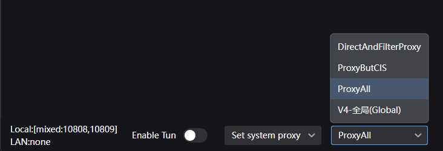

В предустановках есть три набора правил маршрутизации. Каждый определяет, какой трафик идёт через VPN, а какой — напрямую.

### DirectWithBrowserProxy

Пропускает весь трафик напрямую (не через VPN), кроме Discord, Instagram и YouTube. Также проксирует весь трафик внутреннего прокси для расширения SwitchyOmega.

Рекомендуется для повседневного использования — не проксирует трафик игр и не увеличивает задержку.

### ProxyButCIS

Пропускает весь трафик через VPN, но трафик сайтов РФ, Беларуси и Казахстана идёт напрямую. Использует прокси WARP от Cloudflare, чтобы скрыть факт использования VPN от провайдера.

Подходит, если важно выходить в интернет в РФ со своего оригинального IP.

### ProxyAll

Пропускает весь трафик через VPN без исключений.

### Общие правила во всех наборах

- Блокировка рекламы на уровне DNS
- Пропуск трафика локальной сети напрямую
- Пропуск торрентов напрямую (на сервере они заблокированы)

### Активация правила

На главном экране v2rayN выберите нужное правило в списке снизу.

    

**Важно:** правила маршрутизации работают сверху вниз — срабатывает первое правило, которое соответствует условиям. Порядок правил критически важен. Если будете создавать собственные правила, учитывайте их расположение в наборе.

