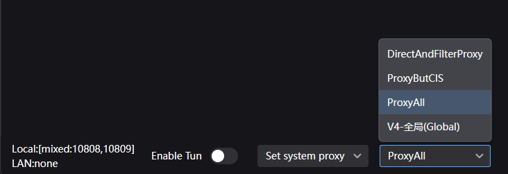

В предустановках есть три набора правил маршрутизации. Каждый определяет, какой трафик идёт через VPN, а какой — напрямую.
### ProxyAll

Пропускает весь трафик через VPN без исключений.

### DirectWithFilterProxy

Пропускает весь трафик напрямую (не через VPN), кроме Discord, Instagram и YouTube и ряда других заблокированных ресурсов. Также проксирует весь трафик в отдельном локальном прокси сервере для Discord.

Рекомендуется для повседневного использования — не проксирует трафик игр и не увеличивает задержку.

### ProxyButCIS

Пропускает весь трафик через VPN, но трафик сайтов РФ, Беларуси и Казахстана идёт напрямую. Рекомендуется для доступа к заблокированным ресурсам, когда важно иметь доступ к сайтам внутри страны (банки, госуслуги и т.д.). **Внимание!** В этом режиме все сайты .ru/.by/.kz будут открываться без VPN.

---

# Что такое TUN режим? (Enable TUN)

TUN режим - это режим работы VPN, который позволяет перенаправлять весь трафик компьютера через VPN. В этом режиме VPN работает на уровне ядра операционной системы, что позволяет играть в игры и пользоваться приложениями через VPN, которые не поддерживают прокси.
Вместе с этим режимом можно использовать любые правила маршрутизации, но рекомендуется `ProxyAll`. Так же рекомендуется переключить `Set system proxy` на `Clear system proxy`

---

### Активация правила

На главном экране v2rayN выберите нужное правило в списке снизу.

    

## Подробнее о правилах маршрутизации в кнопке "Подробнее"

##### Общие правила во всех наборах

- Пропуск трафика локальной сети напрямую
- Пропуск торрентов напрямую (на сервере они заблокированы)

<!-- 

**Важно:** правила маршрутизации работают сверху вниз — срабатывает первое правило, которое соответствует условиям. Порядок правил критически важен. Если будете создавать собственные правила, учитывайте их расположение в наборе.

 -->
