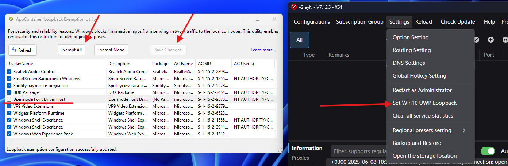

Из-за систем безопасности Windows UWP-приложения (Microsoft Store, Яндекс Музыка, Часы и другие) не работают при включённом системном прокси.

**Совет:** для режима TUN эта настройка не требуется — он работает с UWP-приложениями без дополнительных действий.

### Решение

1. Перейдите в `Settings` → `Set Win10 UWP Loopback`
2. В открывшемся окне нажмите `Exempt All`
3. Найдите в списке `Usermode Front Driver Host` и снимите с него галочку (если такого пункта нет — отлично)
4. Нажмите `Save Changes`

    

Теперь UWP-приложения работают.

**Важно:** при установке новых UWP-приложений придётся повторить этот шаг, выделяя в списке новое приложение.

