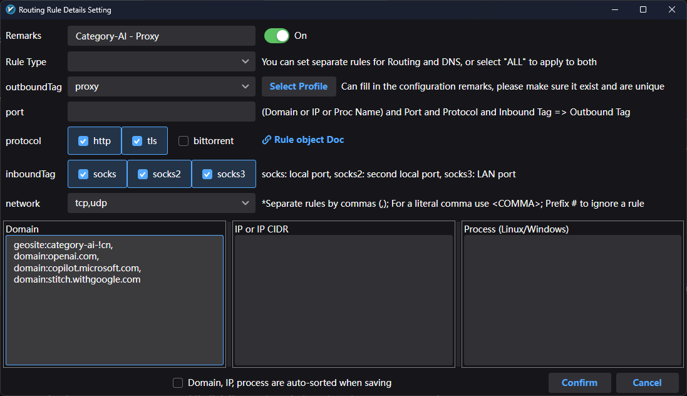

### 🛠 Настройка правила в v2rayN (окно Rule Details)

Это окно позволяет гибко управлять трафиком: направлять его через прокси, напрямую или блокировать.

---

### 1. Основные параметры (Верхняя часть)

-   **Remarks**: Название правила (например, `Cloudflare-Proxy`). Помогает не запутаться в списке.
-   **On (переключатель)**: Включает или выключает правило без его удаления.
-   **outboundTag**: Главное действие для трафика:
    -   `proxy` — направить через VPN/прокси.
    -   `direct` — пустить напрямую (ваш реальный IP).
    -   `block` — разорвать соединение (заблокировать).
-   **port**: Позволяет ограничить правило конкретными портами (например, `80, 443`). Если пусто — применяются ко всем. Рекомендуется оставлять пустым.
-   **protocol**: Фильтр по протоколам (http, tls, bittorrent). Рекомендуется выбрать первые два.
-   **inboundTag (`socks`, `socks2`, `socks3`)**: Выбор локального подключения, где будет распространяться правило. Рекомендуется выбирать все.
-   **network**: Тип трафика (tcp, udp или оба). Рекомендуется выбрать оба.

---

### 2. Условия срабатывания (Нижние блоки)

Правило сработает, если адрес или программа указаны в одном из этих полей:

-   **Domain**: Домены сайтов.
    -   `domain:google.com` — только этот сайт.
    -   `geosite:cloudflare` — встроенная группа всех доменов Cloudflare.
    -   `regexp:.*\.ru$` — регулярное выражение для всех сайтов в зоне .ru.
-   **IP or IP CIDR**: Конкретные IP-адреса или их диапазоны.
    -   `1.1.1.1`
    -   `geoip:cloudflare` — все IP-адреса, принадлежащие Cloudflare.
-   **Process**: Маршрутизация конкретных программ (только для Windows).
    -   Например: `telegram.exe` или `chrome.exe`.

---

### 3. Откуда брать данные для правил

В папке с приложением v2rayN есть папка **bin**. В ней находится файл **geosite.dat**. Это сборник сайтов, которые объединены в группы.
  К примеру, если нужно добавить telegram как правило, нужно поиском в файле пройтись по всем совпадениям **telegram.org**. Если ваш сайт есть в файле, то у него всегда есть категория. Она всегда пишется заглавными буквами, к примеру `TELEGRAM`. 
  Значит, в правило нужно вписать строку `geosite:telegram`.

---

### 4. Алгоритм создания правила

1.  Заполните **Remarks**, чтобы понимать, зачем это правило.
2.  В поле **outboundTag** выберите нужное действие (чаще всего `proxy`).
3.  Впишите целевой сайт в поле **Domain** или IP в соседнее поле.

    > Используйте тот же формат, как в пункте 2!

4.  Нажмите **Confirm** для сохранения.
5.  **Важно:** В общем списке правил переместите созданное правило **вверх**. 

**Важно:** Правила обрабатываются **сверху вниз**. Если сайт подпадает под первое правило в списке, остальные для него игнорируются.

---
## Пример заполнения правила для прокси нейросетей

Разберем, почему мы заполняем поля именно так, как на скриншоте:

- **Remarks (`Category-AI - Proxy`)**: Это просто ярлык. Когда правил станет много (для банков, игр, работы), такое название поможет мгновенно найти нужное.
- **outboundTag (`proxy`)**: Самый важный пункт. Мы выбираем `proxy`, чтобы трафик шел через сервер, так как большинство нейросетей (ChatGPT, Claude) заблокированы по прямому IP.
- **protocol (`http`, `tls`)**: 
    - `tls` — это зашифрованный трафик (HTTPS), на котором работают все современные чат-боты.
    - `http` — нужен для первичного соединения.
    - *Почему не bittorrent?* Чтобы случайно не начать скачивать тяжелые файлы через прокси, если у вас запущена раздача.
- **inboundTag (`socks`, `socks2`, `socks3`)**: Эти галочки гарантируют, что правило будет работать для всех локальных подключений, через которые ваши браузеры и приложения «общаются» с v2rayN.
- **network (`tcp,udp`)**: 
    - `tcp` — база для загрузки страниц. 
    - `udp` — необходим для протокола QUIC (HTTP/3), который активно используют Google и Microsoft для ускорения работы своих сервисов. Без него сайты могут подтормаживать.
- **Domain (Список адресов)**:
    - `geosite:category-ai-!cn` — это «умная» группа. Префикс `!cn` говорит программе: «используй список нейросетей, кроме китайских». Это удобно, так как не нужно вписывать десятки сайтов вручную.
    - `domain:openai.com` — прямая «страховка» для доступа к ChatGPT, если база geosite еще не обновилась.
    - `domain:copilot.microsoft.com` — отдельный адрес для корректной работы Copilot от Microsoft. 
    - `domain:stitch.withgoogle.com` — новое приложение для генерации интерфейсов (копия Figma). Поскольку его нет в geosite файлах, мы указываем вручную.
    

    

---

**Совет:** Если вы хотите, чтобы список внутри правила был аккуратным, включите галочку **"Domain, IP, process are auto-sorted when saving"** внизу окна. Программа сама отсортирует записи по алфавиту при сохранении.

